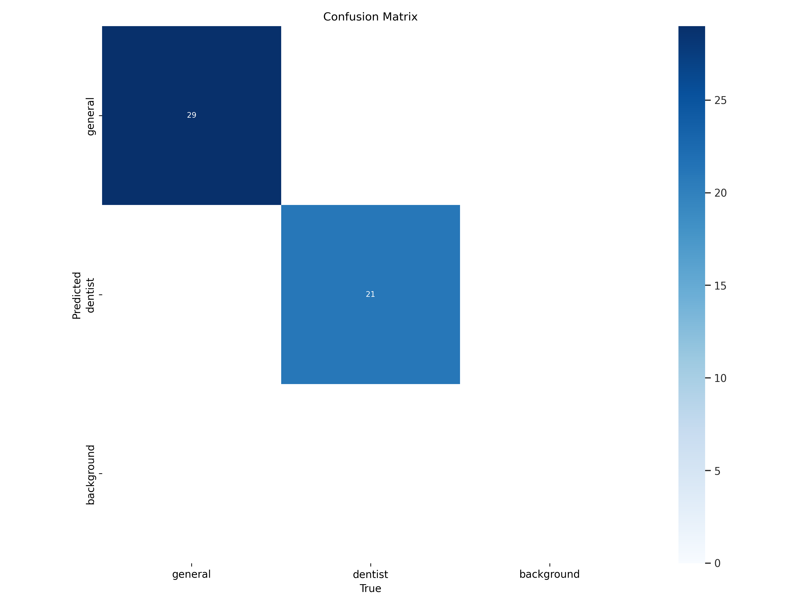
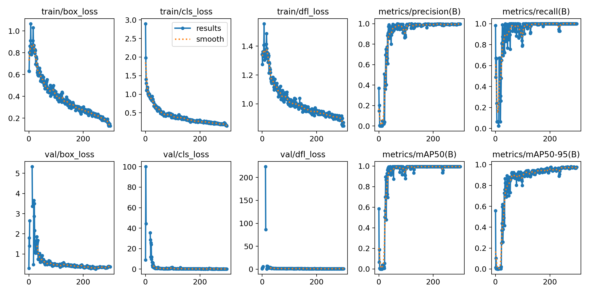

# Object Detection with YOLO for Doctor's ID Cards

## Overview
This project focuses on detecting and classifying doctor's ID cards using the YOLO (You Only Look Once) object detection algorithm. The model is trained on a custom dataset that we have collected and annotated, which consists of two labels: general practitioner and dentist. Given the small sample size of the dataset, various data augmentations were applied to improve model performance.

## Dataset
The dataset includes images of ID cards for doctors, annotated with bounding boxes and labels indicating whether the ID is for a general practitioner or a dentist. To enhance the dataset, some data augmentation techniques were applied using albumentations library.

## Model Training
We used YOLO, a state-of-the-art object detection algorithm, for this task. The model was trained on the augmented dataset, and the following losses and metrics were tracked:

- **Box Loss**: Measures the accuracy of the bounding box predictions.
- **Classification Loss**: Measures the accuracy of the class predictions.
- **DFL Loss**: Distribution Focal Loss used for bounding box regression.
- **Precision**: The ratio of correctly predicted positive observations to the total predicted positives.
- **Recall**: The ratio of correctly predicted positive observations to all observations in the actual class.
- **mAP50**: Mean Average Precision at 50% IoU.
- **mAP50-95**: Mean Average Precision across different IoU thresholds.

## Results
### Confusion Matrix

The confusion matrix shows that the model has achieved a classification accuracy of 100% on the test set, correctly identifying all general practitioner and dentist ID cards.

### Losses and Metrics

The training and validation losses indicate that the model has learned to generate accurate bounding boxes and classify the ID cards correctly. The low bounding box validation loss is a testament to the model's ability to predict bounding boxes with high precision.

## Conclusion
The YOLO model trained on our custom dataset for doctor's ID cards demonstrates excellent performance, achieving 100% classification accuracy on the test set. The low bounding box validation loss further validates the model's capability in accurately detecting and classifying ID cards. This project highlights the effectiveness of data augmentation techniques in enhancing model performance, especially when working with small datasets.

## Future Work
To further improve this project, we plan to:
- Collect and annotate more data to expand the dataset.
- Experiment with different versions of the YOLO algorithm.
- Optimize the model for deployment in real-time applications.

## Acknowledgments
We would like to thank everyone who contributed to data collection and annotation, and to the development and training of the model.

## References
- [YOLO: You Only Look Once](https://github.com/ultralytics/ultralytics)
- [Data Augmentation Techniques](https://github.com/albumentations-team/albumentations)

---

Feel free to contribute to this project by creating issues or submitting pull requests. For any questions or suggestions, please contact us at [mohamedibrahim.amara@gmail.com].
